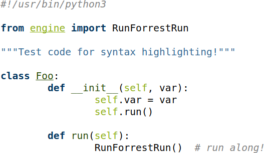

A `Pygments <http://pygments.org/>`_ style based on the
`Corporate Design <http://www.ruhr-uni-bochum.de/cd/>`_ of the
`Ruhr-University Bochum <https://www.ruhr-uni-bochum.de/>`_.

The color definitions have been taken from the `Corporate Design Manual
<https://www.ruhr-uni-bochum.de/cd/cd-2016/download/cd_manual_beta.pdf>`_.

``pygments-style-rub`` is compatible with Python 2 & 3.

Install the `current PyPI release
<https://pypi.python.org/pypi/pygments-style-rub>`__:

.. code:: shell-session

    $ pip install pygments-style-rub

Or install the development version from GitHub:

.. code:: shell-session

    $ pip install git+https://github.com/Holzhaus/pygments-style-rub

Usage
~~~~~

After installation, you can use ``rub`` like any other Pygments style, e.g.
on the command line:

.. code:: shell-session

    $ pygmentize -l python -O style=rub -o output.html code.py

Or you can use it with the
`minted package in LaTeX <https://www.ctan.org/pkg/minted>`_:

.. code:: tex

    \documentclass{article}
    \usepackage{minted}
    \usemintedstyle{rub}
    \begin{document}
        \inputminted{python}{code.py}
    \end{document}

License
~~~~~~~

This project has been released under the terms of the BSD-License. Please read
the ``LICENSE`` file for more information.
